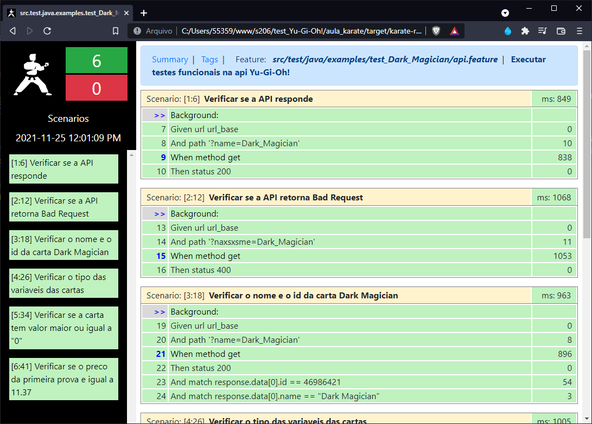

# Testes Yu-Gi-Oh! API




## Como Iniciar o Projeto?

1. Para executar o projeto é necessário ter o <code>Java</code> e o <code>Maven</code> instalados.

    <a href="https://mkyong.com/maven/how-to-install-maven-in-windows/">
    How to install Maven on Windows
    </a>

2. Dentro do terminal diretamente no diretório do projeto insira o seguinte comando para executar os testes:
    ```bash
    mvn clean test -f "pom.xml" -Dtest=ApiTestRunner "-Dkarate.options=src\test\java\examples\test_Dark_Magician\api.feature"
    ```
